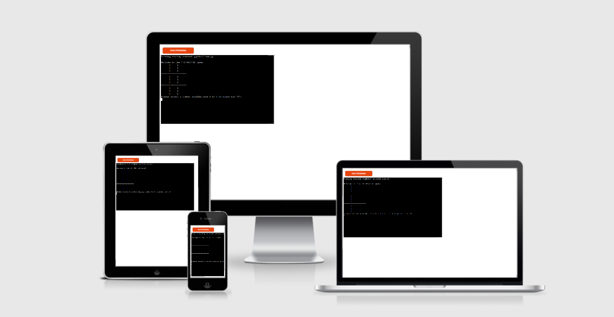
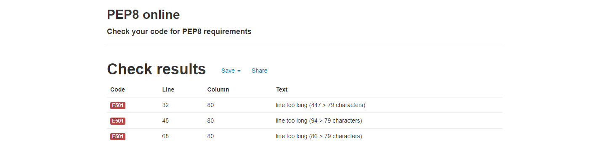

# TIC-TAC-TOE

This python project has been build over a simple idea of creating a product that offers something well-known in a terminal format.

TIC-TAC-TOE is as the name suggests, a tic tac toe game where the user plays against the computer to win.

TIC-TAC-TOE was created for my Milestone Project 3 in the Full Stack Web Development course I am currently undertaking at Code Institute.

[Live website link](https://tic-tac-toe-ms3.herokuapp.com/)

# How to play

TIC-TAC-TOE is a very simple and straightforward game. This version of it allows you to only play against the computer and not against another player. 

To play you have to select a number from 1 to 9, anthing under or over will prompt you to insert the number again.
The player can only input numbers, no letters or other special characters are allowed.
The player plays as X and the computer plays as O.
First to reach 3 X's or O's wins, otherwise the game is a tie.

# Features

## Existing Features

1. Players can only play against the computer.
2. The computer will try to win and caculate it's choices, rather than just randomly placing its choice.
3. The game accepts user input.
4. Input validation:
    * Users cannot input numbers under 1 or over 9.
    * Users cannot input letters or special characters, only numbers are allowed.
    * Users cannot choose the same number twice.

## Future Features

1. Introduce score tracking.
2. Introduce high score feature.
3. Introduce win streak tracking feature.
4. Introduce player vs player feature.

# Data Model

The game uses a board list. The list is made out a for loop to iterate through the list items.
The board is diplayed using a display_board function consisting of print statements.
The player move is registered using a player_move function and validated using two auxiliary functions: a check_move function and available_space function that validate the users input and check to see if chosen space is available.
The computer function looks checks to see what space the player has taken, looks into posible choices that would help it win the game and then makes its choice.
The winning combinations function uses a return statement to check for possible winning combinations and if any of them have been met.

# Testing

## Solved Bugs
    * When the game was a tie, the user would get a duplicate tie game mesage, which was being caused by a duplicate print function, which was removed.
    * When the user was promt with the choice to play another game or quit, if the user would input 'yes', the game would crash. The issue was being caused due to missing paranthesis on the user_reply.lower function call.

## Remaining Bugs
    * No remaining bugs

## Validator testing
    * PEP8 was used to check the code. The only errors returned are 3 lines that go over 79 characters. The code was not changed in order to maintain functionality.

# Deployment
This project was deployed using Code Institute's mock terminal for Heroku.

## Deployment steps
* Fork or clone the repository
* Create a new Heroku App
* Create 2 buildbacks in the settings tab of the app:
    * 1st will be to Python
    * 2nd will be to NodeJS
    * Please bear in mind tha the order of the buildbacks is extremely important, so add them in the provided order
* Link the Heorku App to the GitHub repository. This can be done from the deployment tab of the app
* Click the deploy button at the bottom of the deploy tab of the app

# Acknowledgements
 To my mentor Rahul for providing invaluable advice and support.

 Code Institute for their support.

 Slack community members for offering advice and feedback.