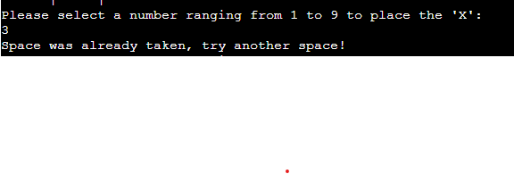

# TIC-TAC-TOE

This python project has been build over a simple idea of creating a product that offers something well-known in a terminal format.

TIC-TAC-TOE is as the name suggests, a tic tac toe game where the user plays against the computer to win.

TIC-TAC-TOE was created for my Milestone Project 3 in the Full Stack Web Development course I am currently undertaking at Code Institute.

[Live website link](https://tic-tac-toe-ms3.herokuapp.com/)

# How to play

TIC-TAC-TOE is a very simple and straightforward game. This version of it allows you to only play against the computer and not against another player. 

To play you have to select a number from 1 to 9, anthing under or over will prompt you to insert the number again.
The player can only input numbers, no letters or other special characters are allowed.
The player plays as X and the computer plays as O.
First to reach 3 X's or O's wins, otherwise the game is a tie.

# Features

## Existing Features

1. Players can only play against the computer.
2. The computer will try to win and caculate it's choices, rather than just randomly placing its choice.
3. The game accepts user input.
4. Input validation:
    * Users cannot input numbers under 1 or over 9.
    * Users cannot input letters or special characters, only numbers are allowed.
    * Users cannot choose the same number twice.

## Future Features

1. Introduce score tracking.
2. Introduce high score feature.
3. Introduce win streak tracking feature.
4. Introduce player vs player feature.